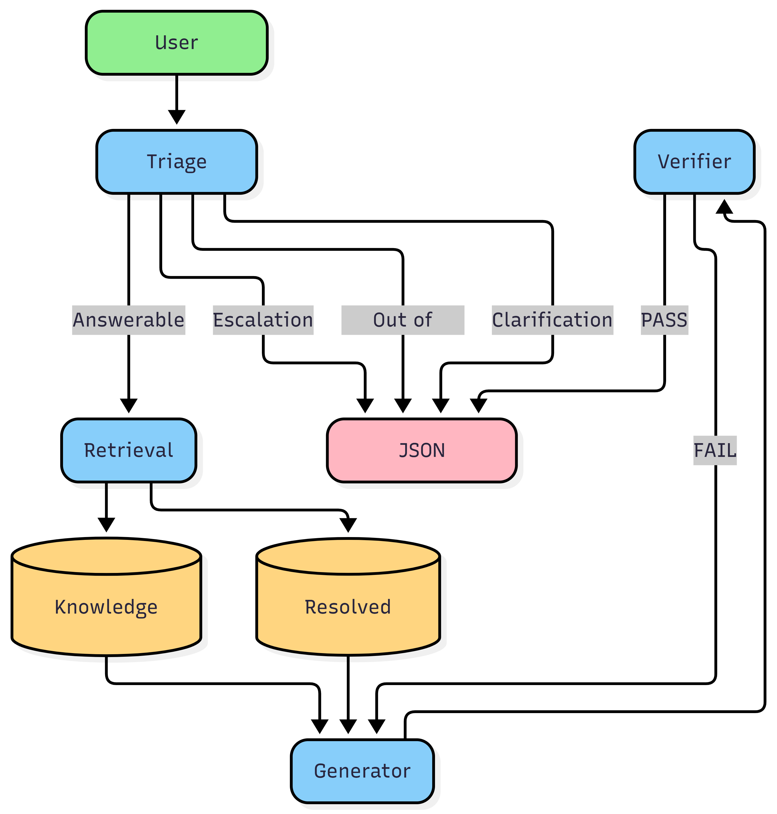

# 🚀 OrbitDesk AI Support Agent

The **OrbitDesk AI Support Agent** is a local-first **Retrieval-Augmented Generation (RAG)** application developed to answer technical support questions using an internal knowledge base and previously resolved support cases. The project was built as part of an AI Engineer Internship assignment with the objective of demonstrating graph-based AI workflow orchestration, semantic retrieval, local language model inference, and structured response generation.

Unlike cloud-based AI assistants, this application performs the complete workflow locally after the required models have been downloaded. It combines semantic document retrieval with a locally hosted Large Language Model (LLM) to generate responses that are grounded in the supplied documentation. Every generated answer is verified before being returned to the user, ensuring traceability and reducing unsupported responses.

The workflow is implemented using **LangGraph**, allowing each stage of the pipeline to be represented as an independent node with shared state and conditional routing. The system classifies incoming requests, retrieves relevant evidence, generates responses, validates the output, and returns a structured JSON response containing confidence scores and supporting sources.

---

# 🎯 Project Objectives

The primary objectives of this project are:

- Build a fully local Retrieval-Augmented Generation (RAG) support assistant.
- Demonstrate graph-based workflow orchestration using LangGraph.
- Retrieve relevant documentation using semantic search.
- Generate grounded responses using a locally hosted Hugging Face language model.
- Verify generated responses before presenting them to users.
- Support multiple workflow paths including clarification, escalation, and out-of-scope handling.
- Return structured JSON responses suitable for integration with downstream systems.

---

# ✨ Key Features

- 🧠 Intelligent Query Classification
- 📚 Retrieval-Augmented Generation (RAG)
- 🔍 Semantic Search using FAISS
- 📖 Knowledge Base Retrieval
- 📄 Resolved Case Retrieval
- 🤖 Local TinyLlama Language Model
- 🏗️ LangGraph Workflow Orchestration
- ✅ Response Verification
- 📊 Confidence Scoring
- 📝 Source Attribution
- 👨‍💻 Human Escalation Workflow
- ❓ Clarification Workflow
- 🚫 Out-of-Scope Detection
- 📦 Structured JSON Output
- 🧩 Modular Python Architecture

---

# 🏗️ System Architecture

The application follows a modular graph-based architecture where every processing stage is implemented as an independent LangGraph node. Each node performs a dedicated responsibility while sharing a common application state.



---

# ⚙️ Workflow Overview

```text
                    User Question
                          │
                          ▼
                   Triage Node
                          │
      ┌───────────────────┼────────────────────┐
      │                   │                    │
      ▼                   ▼                    ▼
 Answerable      Requires Escalation    Out of Scope
      │                   │                    │
      ▼                   ▼                    ▼
 Retrieval         Escalation        Out-of-Scope
      │             Response            Response
      ▼
 Generator
      │
      ▼
 Verifier
      │
      ▼
 Final JSON Response
```

---

# 🔄 Workflow Description

The application processes every user query through the following stages:

### Step 1 – User Query

The workflow begins when a user submits a support-related question through the command-line interface.

---

### Step 2 – Triage Node

The Triage Node analyzes the incoming question and determines which workflow should be executed.

Possible classifications include:

- Answerable
- Requires Clarification
- Requires Escalation
- Out of Scope

Only answerable questions proceed to document retrieval.

---

### Step 3 – Retrieval Node

For answerable questions, the Retrieval Node performs semantic similarity search using FAISS.

Relevant passages are retrieved from:

- Internal Knowledge Base
- Previously Resolved Support Cases

The retrieved evidence is passed to the Generator Node.

---

### Step 4 – Generator Node

The Generator Node uses the locally running TinyLlama model to generate a response based exclusively on the retrieved evidence.

The prompt instructs the model to:

- Use only supplied documentation.
- Avoid inventing information.
- Produce concise responses.
- Follow the required output format.

---

### Step 5 – Verification Node

The generated response is validated before being returned.

The verification stage checks:

- Whether the answer is supported by retrieved evidence.
- Whether required fields are present.
- Whether the output follows the expected JSON schema.
- Whether unsupported information has been introduced.

---

### Step 6 – Final Response

The application returns:

- Classification
- Generated Answer
- Confidence Score
- Verification Status
- Human Escalation Flag
- Source References

---

# 🛠️ Technology Stack

| Category | Technology |
|-----------|------------|
| Programming Language | Python |
| Workflow Orchestration | LangGraph |
| Vector Search | FAISS |
| Embedding Model | sentence-transformers/all-MiniLM-L6-v2 |
| Local Language Model | TinyLlama-1.1B-Chat-v1.0 |
| Deep Learning Framework | PyTorch |
| Transformer Library | Hugging Face Transformers |
| Logging | Python Logging |
| Data Sources | Knowledge Base & Resolved Cases |

---

# 🧠 AI Models Used

## Large Language Model

| Property | Value |
|----------|-------|
| Model | TinyLlama-1.1B-Chat-v1.0 |
| Framework | Hugging Face Transformers |
| Execution | Local |
| Device | CPU |

---

## Embedding Model

| Property | Value |
|----------|-------|
| Model | sentence-transformers/all-MiniLM-L6-v2 |
| Framework | Sentence Transformers |
| Purpose | Semantic Retrieval |

---
## AI Coding Assistant Disclosure

This project was developed with assistance from ChatGPT (OpenAI) for:
- Brainstorming the project architecture
- Debugging Python code
- Improving documentation
- Explaining implementation concepts

All code was reviewed, modified, integrated, and tested by the author. The final design decisions, implementation, and validation are my own.
---

# 📂 Project Structure

```text
orbitdesk-support-agent/
│
├── app.py
├── graph.py
├── config.py
├── state.py
├── build_index.py
├── requirements.txt
├── README.md
├── LICENSE
├── OrbitDesk_AI_Support_Agent_Report.docx
├── OrbitDesk_AI_Support_Agent_Report.pdf
│
├── models/
│   └── llm.py
│
├── nodes/
│   ├── triage.py
│   ├── retrieval.py
│   ├── generator.py
│   └── verifier.py
│
├── utils/
│   ├── embeddings.py
│   ├── loader.py
│   └── logger.py
│
├── knowledge_base/
├── resolved_cases/
├── vector_store/
│
├── diagrams/
│   └── architecturediagram.png
│
├── screenshots/
│   ├── Screenshot 1.png
│   ├── Screenshot 2.png
│   ├── Screenshot 3.png
│   ├── Screenshot 4.png
│   ├── Screenshot 5.png
│   ├── Screenshot 6.png
│   └── Screenshot 7.png
│
└── tests/
```

---

# 🚀 Installation Guide

## Step 1 – Clone the Repository

```bash
git clone https://github.com/Dhanushsj12/orbitdesk-support-agent.git
```

Move into the project directory.

```bash
cd orbitdesk-support-agent
```

---

## Step 2 – Create a Virtual Environment

```bash
python -m venv .venv
```

---

## Step 3 – Activate the Virtual Environment

### Windows

```bash
.venv\Scripts\activate
```

### Linux / macOS

```bash
source .venv/bin/activate
```

---

## Step 4 – Install Dependencies

```bash
pip install -r requirements.txt
```

---

## Step 5 – Build the FAISS Vector Index

```bash
python build_index.py
```

This step processes the knowledge base and resolved support cases to create the semantic vector index used during retrieval.

---

## Step 6 – Run the Application

```bash
python app.py
```

After launching the application, enter a support-related question in the terminal to begin interacting with the AI Support Agent.

---
# 📥 Sample Input

The following example demonstrates how users interact with the application through the command-line interface.

```text
Can a Viewer create API credentials?
```

---

# 📤 Sample Output

```json
{
  "classification": "answerable",
  "answer": "No. Viewers cannot create workspace API credentials. Only Owners and Admins can create or revoke workspace API credentials.",
  "confidence": 0.9,
  "verified": true,
  "requires_human": false,
  "reason": "Answer verified.",
  "sources": [
    {
      "source_id": "05_api_credentials",
      "type": "knowledge_base"
    },
    {
      "source_id": "02_roles_and_permissions",
      "type": "knowledge_base"
    }
  ]
}
```

---

# 📸 Application Demonstration

The following screenshots demonstrate different execution paths of the LangGraph workflow.

---

## ✅ Test Case 1 – Answerable Query

### User Question

```text
Can a Viewer create API credentials?
```

### Expected Workflow

- Triage → Answerable
- Retrieval → Knowledge Base
- Generator → TinyLlama
- Verification → Passed

<p align="center">

</p>

---

## 🔐 Test Case 2 – Security Question

### User Question

```text
What should I do if my API credential secret is exposed?
```

### Expected Workflow

- Triage → Answerable
- Retrieval → Multiple Documents
- Generator
- Verification

<p align="center">

</p>

---

## 👨‍💼 Test Case 3 – Admin Permissions

### User Question

```text
What permissions does an Admin have?
```

### Expected Workflow

- Triage
- Retrieval
- Generator
- Verification

<p align="center">

</p>

---

## 🚨 Test Case 4 – Escalation Workflow

### User Question

```text
I followed every troubleshooting step in the documentation but my scheduled export still fails.
```

### Expected Workflow

- Triage
- Requires Escalation
- Safe Escalation Response

<p align="center">

</p>

---

## 🚫 Test Case 5 – Out-of-Scope Request

### User Question

```text
Can you refund my subscription?
```

### Expected Workflow

- Triage
- Out of Scope
- Safe Response

<p align="center">

</p>

---

## ❓ Test Case 6 – Clarification Request

### User Question

```text
Help
```

### Expected Workflow

- Triage
- Requires Clarification

<p align="center">

</p>

---

## ❓ Test Case 7 – Ambiguous Query

### User Question

```text
API
```

### Expected Workflow

- Triage
- Requires Clarification

<p align="center">

</p>

---

# 🔄 Supported Workflows

The OrbitDesk AI Support Agent supports the following execution paths:

- ✅ Answerable Query
- ✅ Multi-document Retrieval
- ✅ Knowledge Base Search
- ✅ Resolved Case Retrieval
- ✅ Local LLM Generation
- ✅ Response Verification
- ✅ Clarification Requests
- ✅ Human Escalation
- ✅ Out-of-Scope Detection
- ✅ Structured JSON Output

---

# 🧪 Testing Summary

The application was tested using multiple representative support scenarios.

| Test Case | Status |
|-----------|--------|
| Answerable Question | ✅ Passed |
| Security Question | ✅ Passed |
| Multi-document Retrieval | ✅ Passed |
| Clarification Request | ✅ Passed |
| Escalation Workflow | ✅ Passed |
| Out-of-Scope Request | ✅ Passed |

---

# 🤖 Model Configuration

| Component | Model |
|-----------|-------|
| Large Language Model | TinyLlama-1.1B-Chat-v1.0 |
| Embedding Model | sentence-transformers/all-MiniLM-L6-v2 |
| Vector Search | FAISS |
| Workflow Engine | LangGraph |
| Framework | Hugging Face Transformers |
| Deep Learning | PyTorch |

---

# 💻 Hardware Configuration

| Component | Specification |
|-----------|---------------|
| Laptop | Samsung Galaxy Book2 |
| Processor | 12th Gen Intel® Core™ i5-1235U |
| CPU Cores | 10 |
| Logical Processors | 12 |
| RAM | 16 GB |
| Storage | SSD |
| Graphics | Intel® Iris® Xe Graphics |
| Operating System | Windows 11 |
| Execution Device | CPU |

---

# 📊 Performance Summary

| Metric | Value |
|---------|-------|
| Local Execution | Yes |
| Cloud API Used | No |
| Vector Database | FAISS |
| Embedding Technique | Sentence Transformers |
| Retrieval Strategy | Semantic Similarity Search |
| Documents Retrieved | Top 3 |
| Workflow | LangGraph |

---

# ⚖️ Design Decisions

Several implementation decisions were made to satisfy the assignment requirements.

- LangGraph was selected for modular graph orchestration.
- TinyLlama was chosen because it runs efficiently on CPU hardware.
- FAISS enables efficient local semantic retrieval.
- Sentence Transformers generate dense document embeddings.
- Verification is separated from generation to improve reliability.
- Shared state enables communication between graph nodes.
- Conditional routing selects the appropriate execution path.

---

# ⚠️ Current Limitations

The current implementation has the following limitations.

- Response quality depends on the available documentation.
- TinyLlama has lower reasoning capability than larger hosted models.
- The application currently supports single-turn conversations.
- Retrieval quality depends on semantic similarity.

---

# 🎯 Example Use Cases

The system can assist with:

- User permissions
- Workspace configuration
- API credential management
- Security recommendations
- Troubleshooting support issues
- Knowledge Base lookup
- Previously resolved case lookup
- Escalation recommendations

---

# 🤝 AI Assistance Disclosure

AI-assisted development tools, including ChatGPT, were used during the development of this project to:

- Explain implementation concepts.
- Assist with debugging.
- Improve documentation.
- Review project organization.

All architectural decisions, workflow implementation, testing, integration, validation, and final submission were completed and verified by the author.

---

# 🚀 Future Enhancements

Possible future improvements include:

- FastAPI REST API
- Streamlit User Interface
- Docker Deployment
- Azure / AWS Deployment
- Authentication
- Conversation Memory
- Hybrid Retrieval
- Analytics Dashboard
- Automatic Knowledge Base Updates
- PDF Document Support

---

# 📈 Project Highlights

- Local-first AI application
- LangGraph workflow orchestration
- Retrieval-Augmented Generation
- Local TinyLlama inference
- FAISS semantic retrieval
- Verification before response
- Structured JSON output
- Source attribution
- Modular architecture

---

# 📁 Repository Contents

- Source Code
- README Documentation
- Project Report (DOCX)
- Project Report (PDF)
- Architecture Diagram
- Knowledge Base
- Resolved Support Cases
- FAISS Vector Store
- Test Scripts
- Application Screenshots

---

# 👨‍💻 Author

## Dhanush S J

Integrated M.Tech – Software Engineering

Vellore Institute of Technology (VIT)

**GitHub**

https://github.com/Dhanushsj12

**LinkedIn**

https://www.linkedin.com/in/dhanush-s-j-034147271

---

# 📜 License

This project was developed for educational and internship demonstration purposes.

It may be modified and distributed under the terms of the MIT License.

---

# 🙏 Acknowledgements

The following open-source technologies made this project possible:

- LangGraph
- Hugging Face Transformers
- Sentence Transformers
- FAISS
- PyTorch
- TinyLlama
- Python Open Source Community

---

# ⭐ Support

If you found this project useful, consider giving it a ⭐ on GitHub.

Your support helps others discover the project and encourages continued development and improvement.

---